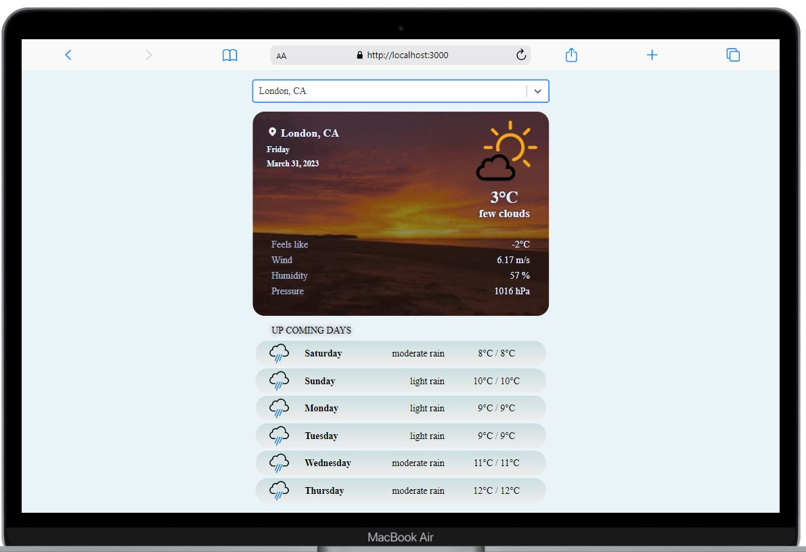

# _WeatherApp_

## Getting Started

WeatherApp is a responsive weather application. It shows both the current weather and forecasts for the up coming days in any location.

Some view from different device.

  <span>
  
</span>&nbsp;&nbsp;&nbsp;&nbsp;
  <span>

</span>&nbsp;&nbsp;&nbsp;&nbsp;
  <span>

</span>

- Enter a city name in the search box at the top of the page.
- See current weather at the top and up coming days at the bottom.
- Clik on the upcoming days buttons for the details.
- ✨Perfect ✨

## Features

- Auto-complete of the city names with a population of 100,000 or more.
- Display detailed information such as temperature, feels like, wind, humidity, and pressure, as well as current weather conditions.
- Display of weather forecasts and detail information such as temprature, feels like, wind speed, sea level pressure, cloudiness, humidity and pressure for the up coming 6 days.
- Animated background that changes according to current weather information.

## Built with

  <span>
  
</span>  React.JS - JavaScript library for building UI component
  <br>
  <span>
  
</span>  SASS - CSS pre-processor

## Prerequisites

WeatherApp requires [Node.js](https://nodejs.org) to run.

## Installing

Install the dependencies.

```sh
npm install
```

Runs the app in the development mode.

```sh
npm start
```

Open [http://localhost:3000](http://localhost:3000) to view it in your browser.

## Authors

This project was developed by Selin Ertan.
